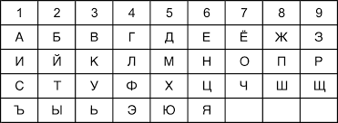
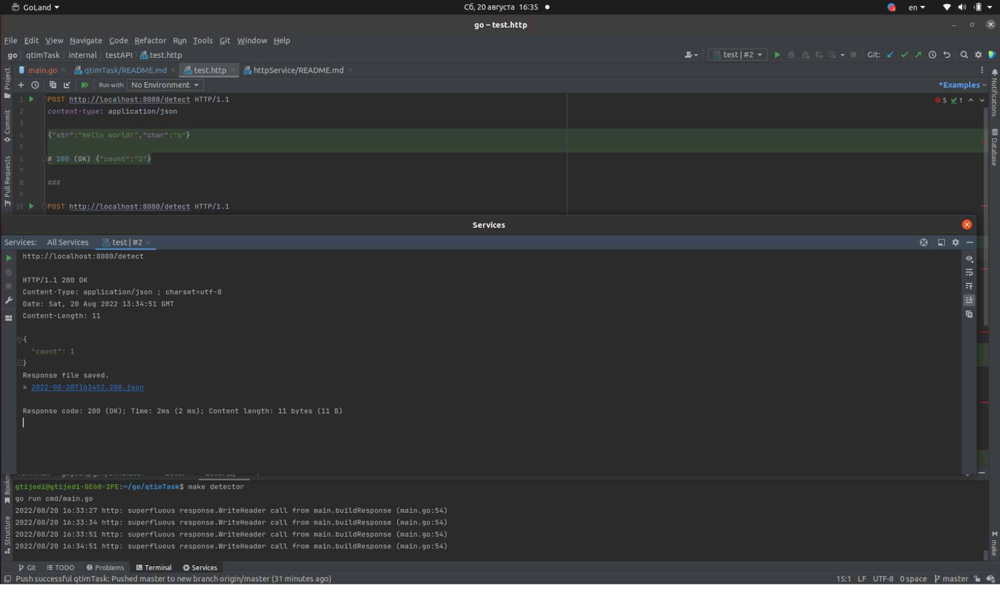

# Symbol detector.
## Тестовое задание от QTim.

>Пишем простое приложение на go, под капотом которого http-сервер с единственной ручкой /detect, принимающей строку str и символ char.
В ответ вернуть количество вхождений переданного символа в переданную строку.
Запросы POST, формат запроса/ответа - json.

>Решение принимается в виде ссылки на гитхаб.
Внутри код приложения и Makefile, есть возможность запустить командой make detector и выполнить тестовые запросы curl'ом (или аналогом).
Должны быть юнит-тесты на основную логику приложения.
Конфигурирование через env/config на усмотрение разработчика, но не является обязательным.

>Пример запроса:
{"str": "hello world", "char": "o"}
Пример ответа:
{"count": 2}

### Требования:
Установите компилятор `Go` (если еще не установлен): https://golang.org/doc/tutorial/getting-started

### Установка и использование:
-Склонируйте репозиторий и запустите командой make detector.После чего сервис будет доступен локально по URL http://localhost:8080.

-Для отправки запросов по адресу воспользуйтесь curl'ом или аналогом, или воспользоваться test.http в ../internal/testAPI.
>Пример запроса:
{"str": "hello world", "char": "o"}
Пример ответа:
{"count": 2}

### Пример работы сервиса:

